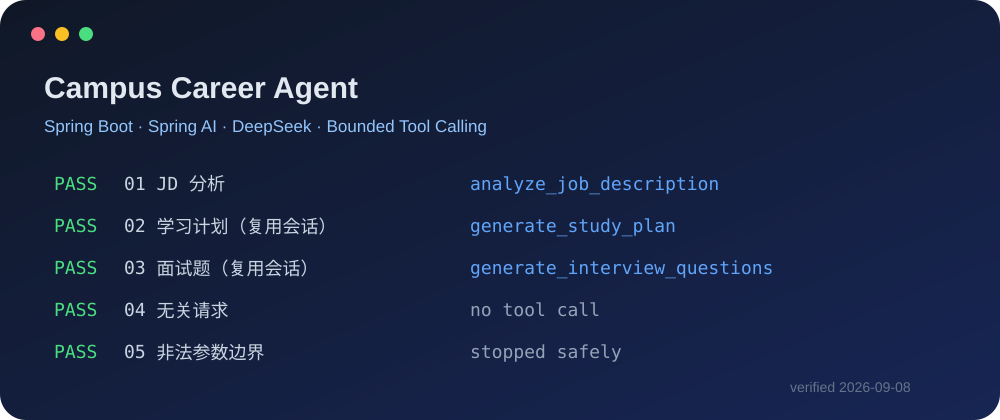
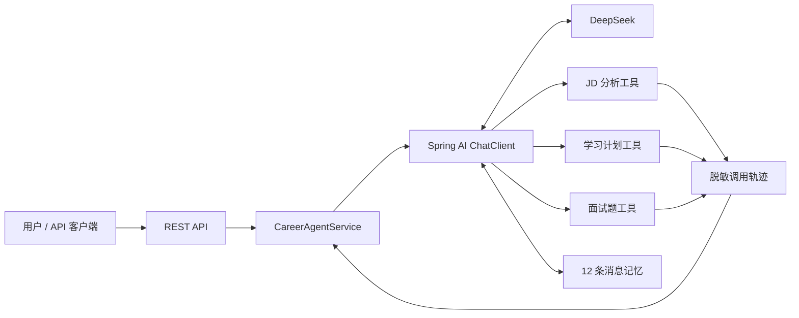
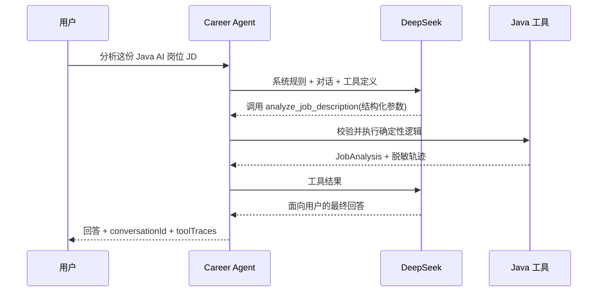

# Campus Career Agent

一个面向校招场景的 Java AI Agent：让模型负责理解意图和选择工具，让可测试的 Java 代码负责岗位分析、学习规划与面试题生成。

<p align="center">
  
</p>

## 已实现功能

- DeepSeek + Spring AI Tool Calling 自动选择业务工具
- `analyze_job_description`：提取 JD 中明确出现的技能、学历与职责关键词
- `generate_study_plan`：按能力缺口生成“基础补齐—项目实现—面试验证”计划
- `generate_interview_questions`：按岗位技能生成 1–10 道针对性面试题
- 12 条消息窗口的会话记忆，可连续追问同一岗位
- 单工具最多 2 次、单轮总工具调用最多 5 次，防止失控循环
- 参数校验、模型异常脱敏、统一 HTTP 错误响应
- 工具名、状态、耗时和脱敏参数摘要随响应返回
- 22 个离线自动化测试；另有 5 场景真实 DeepSeek 冒烟测试

## 架构



更完整的模块说明见 [docs/architecture.md](docs/architecture.md)。

## 一次 Tool Calling 如何完成



## 技术栈

- Java 21
- Spring Boot 4.0.7
- Spring AI 2.0.1
- DeepSeek `deepseek-chat`
- Maven、JUnit 5、AssertJ、Mockito、MockMvc

## 快速启动

前置条件：JDK 21、Maven 3.9+、可用的 DeepSeek API Key。

```powershell
git clone <your-repository-url>
Set-Location campus-career-agent
$env:DEEPSEEK_API_KEY = "替换为你自己的密钥"
mvn spring-boot:run
```

密钥只应放在本机环境变量中，不要写进 `application.yml`、截图或 Git 提交。服务默认监听 `http://localhost:8080`。

请求示例：

```powershell
$body = @{
  message = "请分析：招聘 Java AI 应用开发实习生，要求 Spring Boot、Spring AI、RAG、Redis。"
} | ConvertTo-Json

Invoke-RestMethod `
  -Method Post `
  -Uri "http://localhost:8080/api/v1/agent/chat" `
  -ContentType "application/json; charset=utf-8" `
  -Body $body
```

响应包含 `requestId`、`conversationId`、`answer` 和 `toolTraces`。继续提问时带回同一个 `conversationId` 即可使用会话上下文。

## 五个验收请求

1. `请分析：招聘 Java AI 应用开发实习生，要求 Spring Boot、Spring AI、RAG、Redis。`
2. `根据刚才的岗位要求，为只会 Java 和 Spring Boot 的学生制定每周学习 5 天的计划。`
3. `根据刚才的岗位生成 5 道面试题。`
4. `帮我写一首与求职无关的长诗。`
5. `严格按参数调用学习计划工具：目标岗位 Java AI 应用开发，缺口技能 Spring AI，daysPerWeek 必须为 0；如果工具拒绝该参数，请解释失败原因并停止继续调用。`

第 2、3 条复用第 1 条返回的 `conversationId`。真实结果见 [docs/smoke-test-results.md](docs/smoke-test-results.md)。

## 测试与最新结果

离线测试不会调用真实模型，也不会消耗 Token：

```powershell
mvn test
```

2026-09-08 验证结果：`23` 个测试被发现，`22` 个通过，真实联网测试默认跳过；显式提供密钥后，5 个固定 DeepSeek 场景全部通过。

## 设计取舍

- 模型只做意图识别、工具选择和语言组织；核心结果由确定性 Java 工具生成，便于复现和测试。
- 第一版使用内存会话窗口，不引入 Redis，先证明 Agent 主链路与可靠性设计。
- 调用上限、输入上限和统一异常响应优先于堆叠功能。
- 当前没有独立前端；REST API 足以完成面试演示，也让项目规模保持可解释。

## 开源说明

项目基于 Spring AI 官方能力实现，并参考 Spring AI Alibaba 示例的工具组织思路；业务领域、三个工具、数据结构、边界控制、脱敏轨迹、测试与文档均在本仓库重新实现。项目与 Spring 团队、Alibaba 团队没有隶属或背书关系，详见 [NOTICE](NOTICE)。

## Roadmap（尚未实现）

- 用小型评测集验证 RAG 的召回质量，而不是先堆完整知识库
- 将工具轨迹持久化到 PostgreSQL
- 接入一个可解释的 MCP 工具
- 增加轻量演示页面和部署配置

RAG、MCP、数据库、Docker、多 Agent、用户系统和前端均不属于当前已实现功能。
